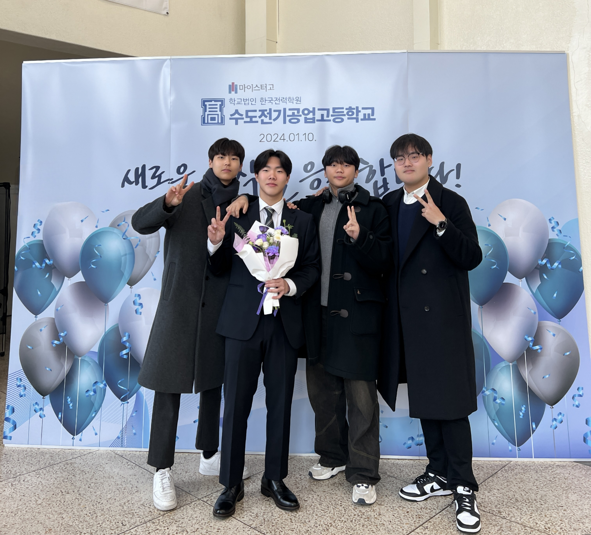
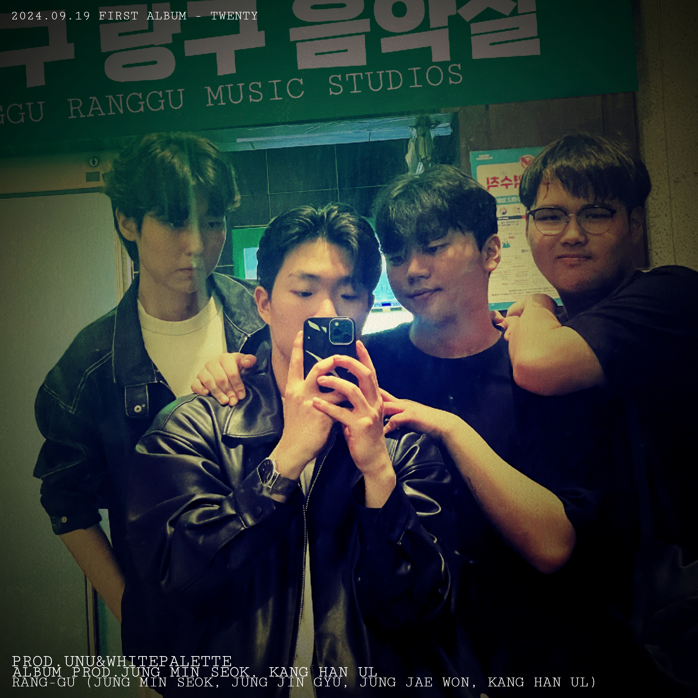
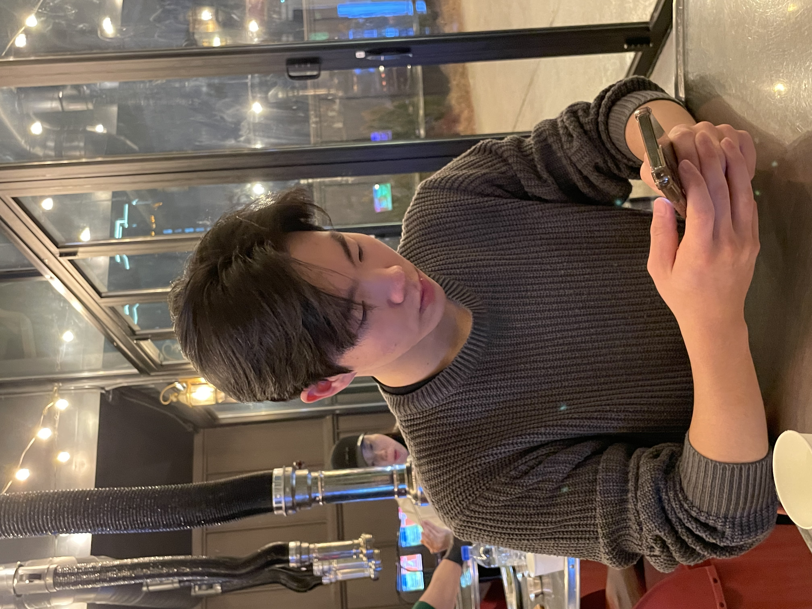

# 🏰 R.랑구 (Jung Trio)

  
  
  
  
  
  
  

## 🌈 프로젝트 소개

랑구팸은 네 명의 특별한 친구들(진규, 재원, 한울, 민석)이 만든 디지털 놀이터입니다. 음악, 여행, 추억을 공유하고 함께 성장하는 우리만의 공간입니다.

### ✨ 핵심 가치

- **연결 (Connection)**: 전 세계에 흩어져 있는 멤버들을 하나로 연결
- **공유 (Sharing)**: 일상의 순간들과 창작물을 함께 나누는 공간
- **성장 (Growth)**: 서로의 발전을 응원하고 기록하는 플랫폼
- **추억 (Memories)**: 소중한 순간들을 영원히 간직하는 디지털 앨범

## 🎮 주요 기능

### 1. 멀티미디어 통합 시스템
- 🎵 음악 스트리밍 & 공유
- 📸 사진 갤러리 & 메모리 월
- 🎮 미니게임 (테트리스, 카드게임 등)
- 📝 위키 시스템

### 2. 개인화 기능
- 🌍 다국어 지원 (한국어, 영어, 독일어)
- 🕒 실시간 세계시계 (서울, 밴쿠버, 루체른)
- 🎨 커스텀 테마 (계절별, 이벤트별)
- 🎯 개인 대시보드

### 3. 소셜 기능
- 💬 실시간 채팅
- 📢 공지사항 시스템
- 🏆 업적 시스템
- 👥 프로필 커스터마이징

## 🛠 기술 스택

### Frontend
- **Framework**: Next.js 13
- **Language**: TypeScript 5.0
- **Styling**: Tailwind CSS, Framer Motion
- **State Management**: React Context, SWR
- **UI Components**: Headless UI, Radix UI

### Backend
- **Database**: MongoDB
- **Storage**: Cloudinary
- **Authentication**: NextAuth.js
- **API**: REST, tRPC

### DevOps
- **Hosting**: Vercel
- **CI/CD**: GitHub Actions
- **Monitoring**: Sentry
- **Analytics**: Vercel Analytics

## 📱 스크린샷

  
  
  

## 🚀 시작하기

### 필수 요구사항
- Node.js 18.0 이상
- MongoDB 6.0 이상
- Yarn 또는 npm

### 설치 방법

1. 저장소 클론
\`\`\`bash
git clone https://github.com/GabrielJung0727/rangu.fam.git
cd rangu.fam
\`\`\`

2. 의존성 설치
\`\`\`bash
yarn install
# 또는
npm install
\`\`\`

3. 환경 변수 설정
\`\`\`bash
cp .env.example .env.local
# .env.local 파일을 적절히 수정
\`\`\`

4. 개발 서버 실행
\`\`\`bash
yarn dev
# 또는
npm run dev
\`\`\`

## 🤝 기여하기

1. 이 저장소를 포크합니다
2. 새로운 브랜치를 생성합니다 (\`git checkout -b feature/amazing-feature\`)
3. 변경사항을 커밋합니다 (\`git commit -m 'feat: Add amazing feature'\`)
4. 브랜치에 푸시합니다 (\`git push origin feature/amazing-feature\`)
5. Pull Request를 생성합니다

## 📜 커밋 컨벤션

- **feat**: 새로운 기능 추가
- **fix**: 버그 수정
- **docs**: 문서 수정
- **style**: 코드 포맷팅
- **refactor**: 코드 리팩토링
- **test**: 테스트 코드
- **chore**: 빌드 업무 수정

## 📄 라이선스

이 프로젝트는 MIT 라이선스를 따릅니다. 자세한 내용은 [LICENSE](LICENSE) 파일을 참조하세요.

## 👥 팀 멤버

<table>
  <tr>
    <td align="center">
      <a href="https://github.com/username1">
         
        <b>진규</b>
      </a>
    </td>
    <td align="center">
      <a href="https://github.com/username2">
         
        <b>재원</b>
      </a>
    </td>
    <td align="center">
      <a href="https://github.com/username3">
         
        <b>한울</b>
      </a>
    </td>
    <td align="center">
      <a href="https://github.com/username4">
         
        <b>민석</b>
      </a>
    </td>
  </tr>
</table>

## 📞 연락처

프로젝트에 대한 문의사항이 있으시다면 아래 방법으로 연락해주세요:

- 이메일: [example@email.com](mailto:example@email.com)
- 디스코드: [랑구팸 서버](https://discord.gg/example)
- 트위터: [@rangufam](https://twitter.com/rangufam)

---

  Made with ❤️ by Rangu Family

